## CLIENT-SERVER ARCHITECTURE WITH MYSQL (PROJECT 5) ##

Client-Server refers to an architecture in which two or more computers are connected together over a network to send and receive requests between one another.
In their communication, each machine has its own role: the machine sending requests is usually referred as __"Client"__ and the machine responding (serving) is called __"Server"__.

A simple diagram of Web Client-Server architecture is presented below:

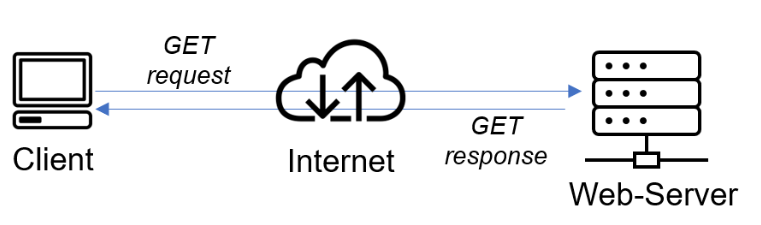

In the example above, a machine that is trying to access a Web site using Web browser or simply ‘curl’ command is a client and it sends HTTP requests to a Web server (Apache or any other) over the Internet.

If we extend this concept further and add a Database Server to our architecture:

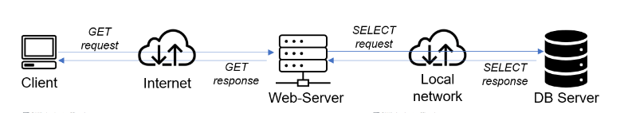

In this case, our Web Server has a role of a __"Client"__ that connects and reads/writes to/from a Database (DB) Server (MySQL, MongoDB, Oracle, SQL Server or any other), and the communication between them happens over a Local Network (it can also be Internet connection, but it is a common practice to place Web Server and DB Server close to each other in local network).

To set up a Client-Server Architecture with Mysql using EC2, we need two instances. We will name them:
* Mysql client.
* Msql server.


We set this up by doing the following:

* create an account on [AWS](https://aws.amazon.com/). 
* we create two instances by selecting __“ubuntu server 20.04 LTS”__ from Amazon Machine Image(AMI)(free tier) for the clie. 
* we select “t2.micro(free tier eligible)”.
* then go to the security group and select “a security group” review and launch.

 How to create an aws free tier account. click [here](https://www.youtube.com/watch?v=xxKuB9kJoYM&list=PLtPuNR8I4TvkwU7Zu0l0G_uwtSUXLckvh&index=7)

This launches us into the instances as shown in the screenshot:

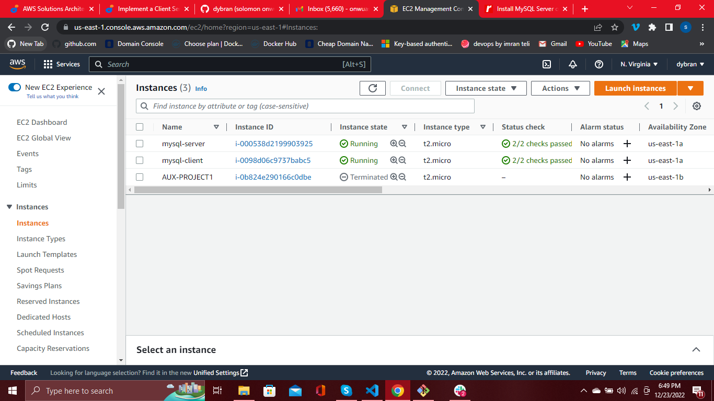

We open our terminal and go to the location of the previously downloaded __PEM file__.

How to download PEM File from __AWS__. Click [here](https://intellipaat.com/community/52119/how-to-download-a-pem-file-from-aws).

We connect to the instances from two seperate ubuntu terminal using the command:

```$ ssh -i dybran-ec2.pem ubuntu@<IP-address>```

This automatically connects to the instance.

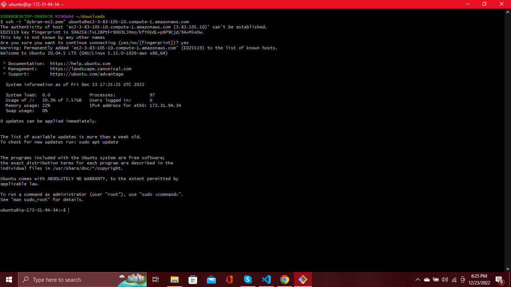

This done for both the mysql client and mysql server.

After connecting to the instances on each of the terminals, we edit the __/etc/hostname/__ file to change the names of each of the server so as to align with the given name on the instance i.e __client__ and __server__ respectively. We do this using the command:


```$ sudo su```

then 

```$ vim /etc/hostname/```

This opens the hostname file. We then edit the content to suit the given names __client__ and __server__ respectively.
We press __ESC :wq and ENTER__ to save.

We then run the commands on the client and server terminals respectively.

```$ hostname client``` for the client

and 

```$ hostname server``` for the server.

we disconnect and reconnect to the instances for these changes to take effect.

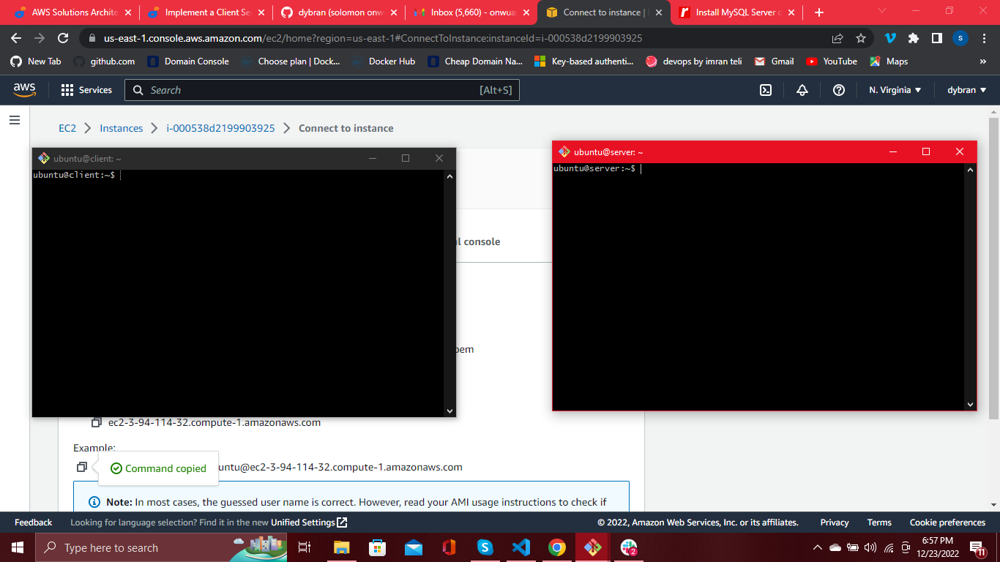

On the __client and server__ terminals we run the command:

```$ sudo apt update```

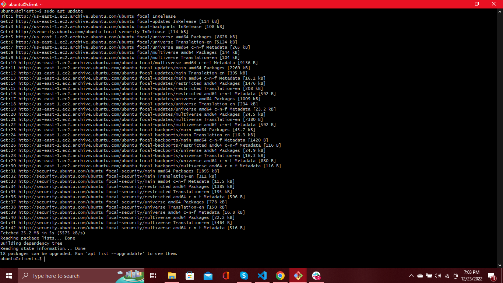


On the __server__ terminal, we install the mysql server.

```sudo apt install mysql-server```

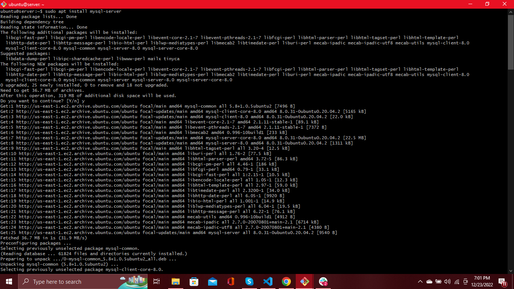

and on the __client__ terminal, we install the mysql client.

```$ sudo apt install mysql-client```


We verify the status of mysql by running the command:

```$ sudo apt systemctl status mysql```

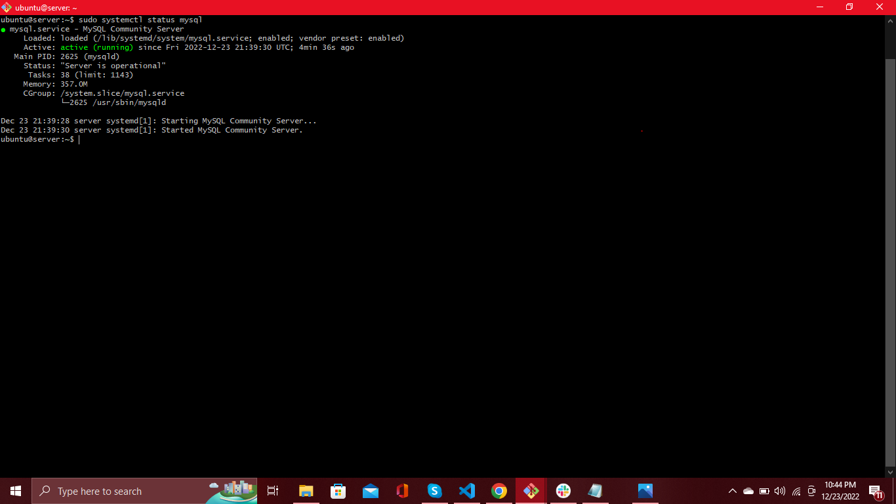


By default, both of the EC2 virtual servers are located in the same local virtual network, so they can communicate to each other using local IP addresses. Use mysql server's local IP address to connect from mysql client. MySQL server uses __TCP port 3306__ by default, so you will have to open it by creating a new entry in __‘Inbound rules’ in ‘mysql server’__ Security Groups. For extra security, do not allow all IP addresses to reach your ‘mysql server’ – allow access only to the specific local IP address of your ‘mysql client’.

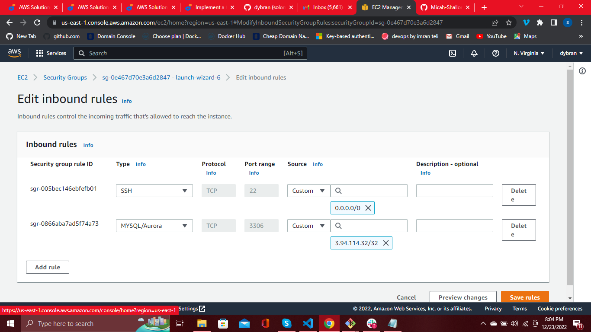

We need to configure MySQL server to allow connections from remote hosts.

```sudo vi /etc/mysql/mysql.conf.d/mysqld.cnf```

Replace __"bind-address" ‘127.0.0.1’ to ‘0.0.0.0’__ like this:

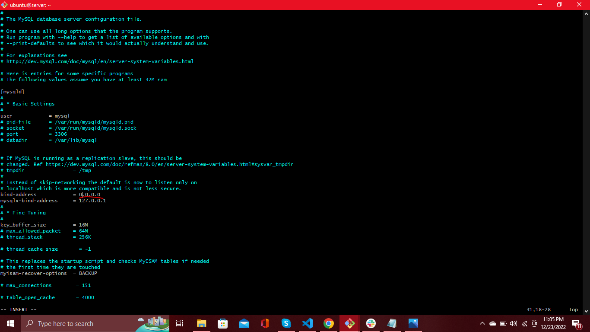

To set up the mysql database in server that the client will be able to connect to, we run the following commands:

```$ sudo mysql```

this lauches us into the mysql database.

Next we run the command:

```mysql> ALTER USER 'root'@'localhost' IDENTIFIED WITH mysql_native_password BY 'PassWord.1';```

we exit. Start the interactive script by running:

```$ sudo mysql_secure_installation```

At the prompt we put in the password we specified earlier i.e __PassWord.1__. To create a validated password, type __y__.
Then choose the strength of the new password you want to create-at the prompt, we put in the new password.

Type __y__ at the following prompts to validate the changes.

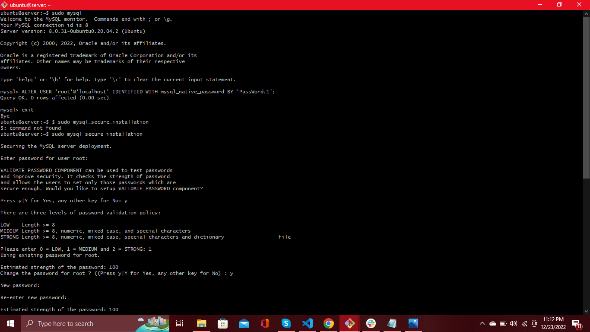
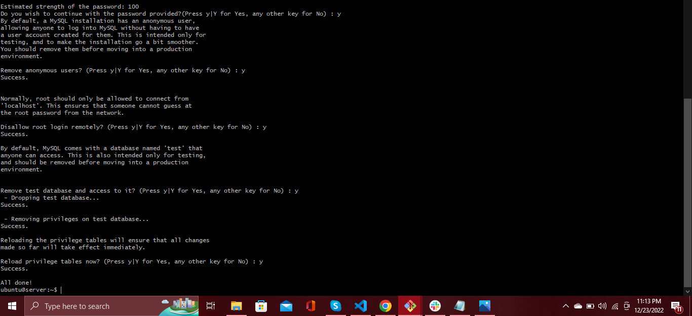

When you’re finished, log in to the MySQL console by typing:

```$ sudo mysql -p```

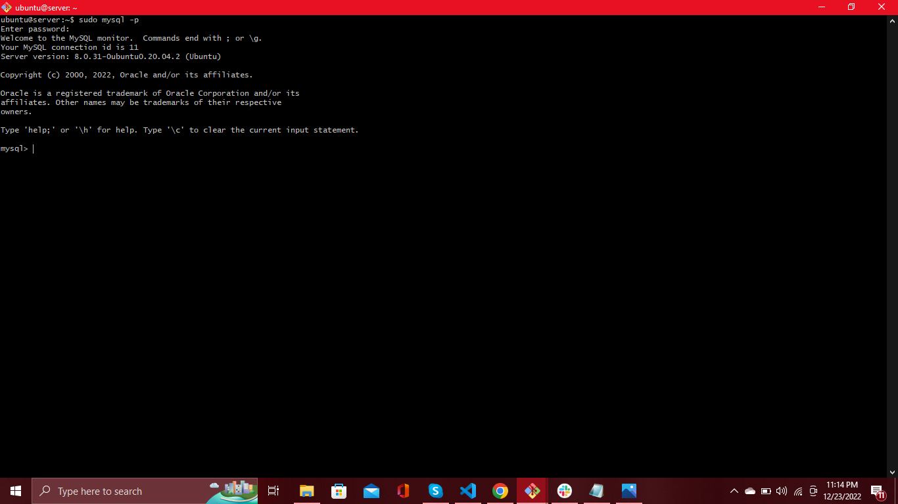

To create a new database, run the following command from your MySQL console:

```$ mysql> CREATE DATABASE `example_database`;```

we replaced _'example_database'_ with _'test_database'_.

Now you can create a new user and grant him full privileges on the database you have just created.

```mysql> CREATE USER 'example_user'@'%' IDENTIFIED WITH mysql_native_password BY 'password';```

we replace _'example_user'_ with _'solomon'_ and _'password'_ with the new password we just created i.e _'Sa4la2xa#'_

To give this user (i.e _'solomon'_) permission over the _'test_database'_ database:

```mysql> GRANT ALL ON example_database.* TO 'solomon'@'%';```

Then, we exit the mysql shell.

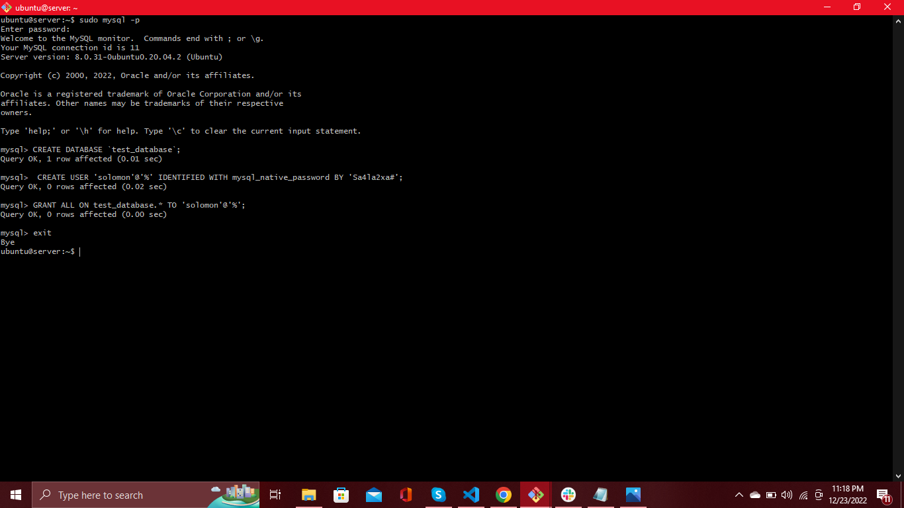


To test if the new user has the proper permissions by logging in to the MySQL console again, this time using the custom user credentials:

```$ mysql -u solomon -p```

at the prompt, we put in our password (i.e _Sa4la2xa#_).
 then run the command:

 ```mysql> SHOW DATABASES;```


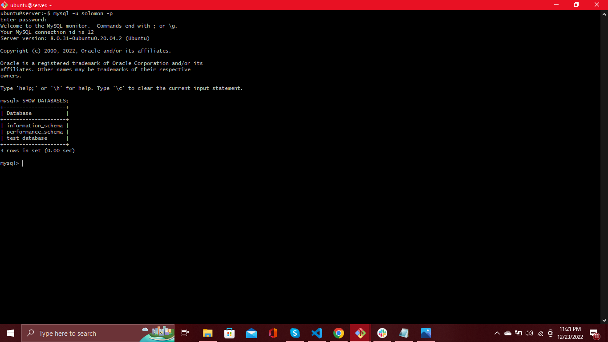

We then go to our __client__ terminal and connect to the mysql server database engine remotely without using the SSH.

```$ mysql -u solomon -h <IP-address> -p```

_<IP-address>_ of the Server.

At the prompt we put in our password.

then run the command

```mysql> SHOW DATABASES;```

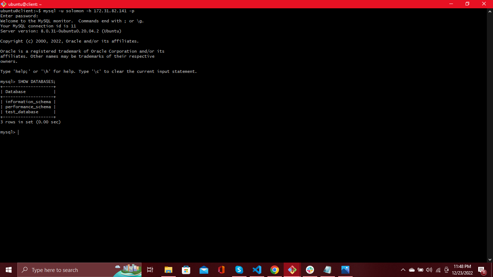

We should be able to access the database. 

__N/B__: If we are unable to connect to the server, we open the __/etc/mysql/my.cnf__ on the server.

```$ vim /etc/mysql/my.cnf```

Check if we can see __bind-address = 127.0.0.1__
if we cant find this, we go and open the __/etc/mysql/mysql.conf.d/
mysqld.cnf__. 

```$ vim /etc/mysql/mysql.conf.d/mysqld.cnf```

and comment out the __bind-address = 127.0.0.1__.

i.e __# bind-address = 127.0.0.1__

then restart the mysql server

```$ sudo systemctl restart mysql```


We have successfully deployed a __fully functional mysql client-server setup.__


